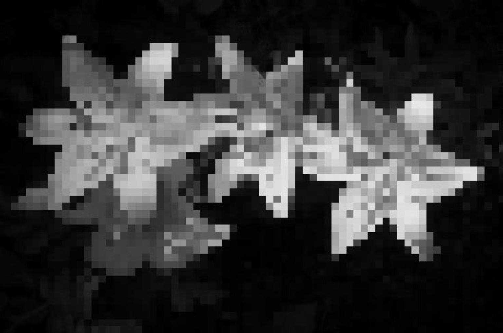
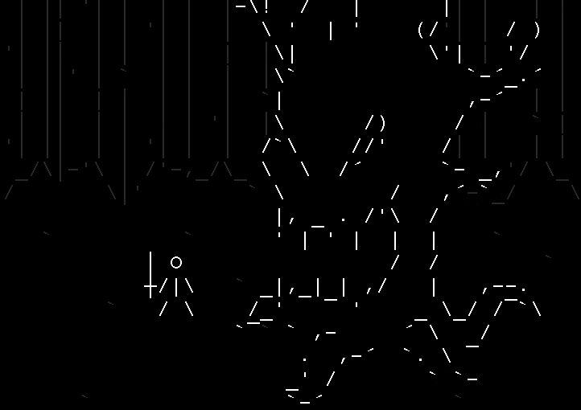
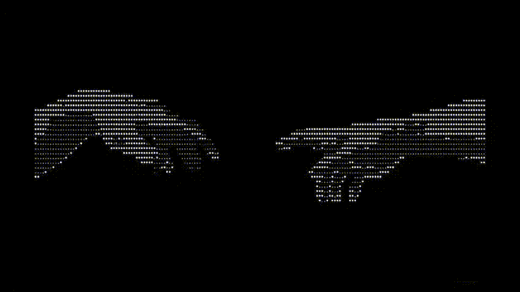

# `abaddonxvii`

<p align="center">
  <code><b>ABADDONXVII</b></code><br/>
  <sub>code / create / break / rebuild</sub>
</p>


<p align="center">

</p>

```text
╔═══════════════════════════════════════════════════════════════════════════╗
║                                                                                        ║
║  ██████╗ ██████╗  █████╗ ██████╗ ██████╗  ██████╗ ███╗   ██╗                  ║
║  ██╔══██╗██╔══██╗██╔══██╗██╔══██╗██╔══██╗██╔═══██╗████╗  ██║                ║
║  ███████║██████╔╝███████║██║  ██║██║  ██║██║   ██║██╔██╗ ██║                 ║
║  ██╔══██║██╔══██╗██╔══██║██║  ██║██║  ██║██║   ██║██║╚██╗██║                 ║
║  ██║  ██║██████╔╝██║  ██║██████╔╝██████╔╝╚██████╔╝██║ ╚████║                 ║
║  ╚═╝  ╚═╝╚═════╝ ╚═╝  ╚═╝╚═════╝ ╚═════╝  ╚═════╝ ╚═╝  ╚═══╝                  ║
║                                                                                        ║
║                      「 コードは芸術、バグは仕様 」                                        ║
║                       code is art, bugs are features                                   ║
║                                                                                        ║
╚═══════════════════════════════════════════════════════════════════════════╝

```

## `02` /  技術スタック · stack

### Languages

| Icon | Focus |
|:---:|:---|
|  | automation, security scripting, tooling, backend & experiments |
|  | performance, reverse engineering, systems & low-level experiments |
|  | structure, semantic web & UI |
|  | interactive web, frontend & web security research |
|  | applications, OOP & backend experiments |


### Tools & ecosystem


| Icon | Notes |
|:---:|:---|
|  | daily driver, custom rice, minimalistic setup |
|  | source-compiled optimization & deep system control |
|  | runit init speed, lightweight minimalist environment |
|  | reproducible configurations & declarative system management |


### Environment & Workflow

| Icon | Setup |
|:---:|:---|
| Zsh + Starship / Fish |
|  | Kitty |
|  | Hyprland / Niri |
|  | Neovim / VS Code |
<span style="font-size: 22px;">🌸</span>| Dark Japanese / AMOLED |


### Security & Pentesting Tools

| Icon | Focus |
|:---:|:---|
|  | penetration testing, security audit OS environment |
|  | network protocol analysis & traffic inspection |
|  | web security testing, HTTP request manipulation & proxy |
|  | exploit development & vulnerability verification |

### 💻 Hardware & Gear

| Icon | Spec / Device |
|:---:|:---|
|  | AMD Ryzen 7 7735HS |
|  | NVIDIA GeForce RTX 4060 |
|  | 32 GB DDR5 |
|  | 2x 1 TB SSD  |
|  | Steam Deck OLED |
|  | DualSense Wireless |


```text
                 .       .       .       .
            .       ╱￣￣￣￣￣￣￣￣╲       .
                 ╱   暗い画面の中   ╲
              ╱     で作っている     ╲
             ╲_______________________╱

                 BLACK IS NOT EMPTY.
                    IT'S THE CANVAS.
```
<p align="center">

</p>

---

## `03` /  GitHub · statistics

<p align="center">
  <a href="https://github.com/abaddonxvii">
    
  </a>
</p>

<p align="center">
  <a href="https://github.com/abaddonxvii">
    
  </a>
</p>

<p align="center">
  <a href="https://github.com/abaddonxvii">
    
  </a>
</p>

<p align="center">
  <a href="https://github.com/abaddonxvii">
    
  </a>
</p>


---

## `04` /  philosophy

```text
        ┌─────────────────────────────────────────────┐
        │                                             │
        │  01  build something useful                │
        │  02  make it look good                     │
        │  03  make it fast                          │
        │  04  break it                              │
        │  05  fix it                                │
        │  06  pretend step 04 was intentional       │
        │                                             │
        └─────────────────────────────────────────────┘
```

<div align="center">

### `「 美しさは機能の一部 」`
**Beauty is part of the function.**

`[ SYSTEM ONLINE ]` · `[ CREATING ]` · `[ DEBUGGING ]` · `[ REBUILDING ]`

</div>

---

<p align="center">
  <sub>Designed in the dark. Written in code. Powered by unreasonable amounts of curiosity.</sub>
</p>

---

## `05` /  项目 · projects & portfolio

<p align="center">
  <a href="https://your-portfolio-link.com">
    
  </a>
</p>

```text
┌─ FEATURED ──────────────────────────────────────────────────────────┐
│                                                                     │
│  [01] Portfolio Web   ──> Minimalistic dark showcase UI             │
│  [02] Web App / Tool  ──> Interactive frontend & custom logic       │
│  [03] Experiments     ──> C++ / Python scripts & system stuff       │
│                                                                     │
└─────────────────────────────────────────────────────────────────────┘
```
### 📂 Featured Repositories

| Project | Description | Tech Stack |
|:---:|:---|:---:|
|  | **[dotfiles](#)**<br>Custom Dark Japanese Hyprland & Niri setup |  |
|  | **[cli-tool](#)**<br>Terminal-based utility & scripting (TUI) |   |
|  | **[web-app](#)**<br>Modern full-stack web application |    |
|  | **[security-research](#)**<br>Pentesting tools & scripts |   |


<p align="center">

</p>
